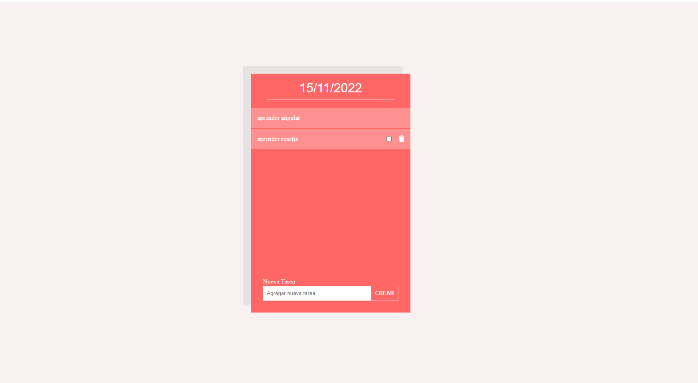

# Aplicación de tareas por hacer.
## Requerimientos:
1. El objetivo de la práctica es entregar una aplicación lo más funcional posible tomando como referencia
    el siguiente enunciado.
2. El titular es la fecha actual de hoy.
3. Desde un formulario se pueden crear nuevas tareas pulsando en el botón “crear”.
    a. Al crear una tarea se añade al final del listado.
4. Al hacer hover sobre un elemento se muestran las opciones de marcar como “completada” o
    “eliminar”.

    a. Al “completar” una tarea el el texto se queda tachado y se mueve la tarea a la primera posición
    del listado.

    b. Al desmarcar el check de completar tarea mover la tarea al final del listado

    c. Al “eliminar” una tarea se pedirá solicitará que una confirmación del usuario en un popup

    i. Título del popup: “¿Quieres eliminar la tarea {Título de la tarea}?”

    ii. Botones del popup: Si / No

    d. Al “eliminar” una tarea se elimina del listado.

5. Cada vez que se realice un acción (crear, completar o eliminar) se imprimirá por consola el listado
(console.log) .

# previa

# Desarrollo 
La aplicacion fue desarrollada con  Angular  version 14.2.9.
requerimientos:
    - nodejs 10 o posterior 

## Obtener el proyecto
Ejecutar
opcion ssh:
~~~
    git clone git@github.com:InforTech07/technical-test-Frontend.git
~~~

opcion https:
~~~
    git clone https://github.com/InforTech07/technical-test-Frontend.git
~~~

## Instalacion de dependencias
Acceder a la carpeta raiz y ejecutar
~~~
npm install
~~~

## Servidor de desarrollo

Ejecutar 
~~~
ng serve
~~~ 
o
~~~
npm run dev
~~~

para iniciar servidor de desarrollo. navega a  `http://localhost:4200/`. La aplicacion se refresca a cualquier cambio.

## Build

Ejecturar 
~~~
ng build
~~~ 
para obtener el build del projecto. Los archivos se obtendran en la carpeta `dist/` del proyecto.

## Ejecucion de test

Ejecutar 
~~~ 
ng test
~~~ 
para ejecutar  los tests unitarios.

